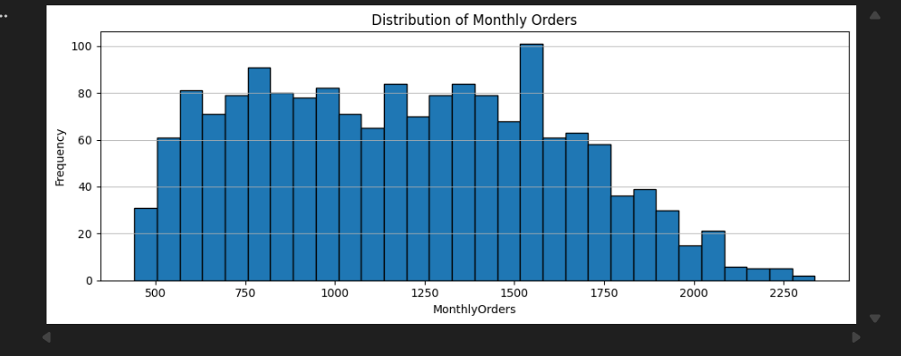
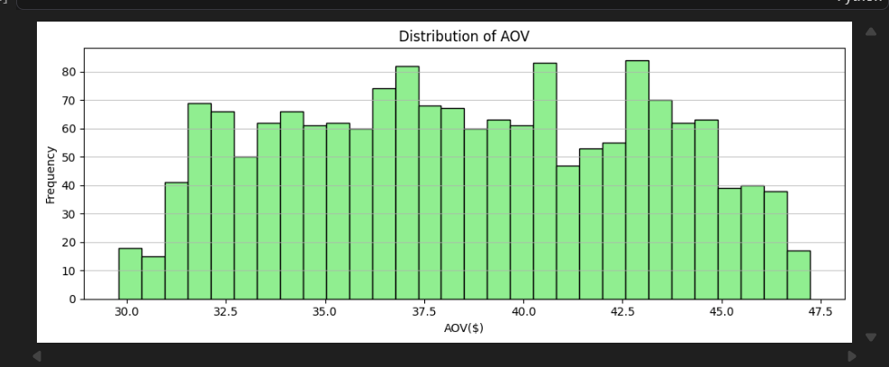
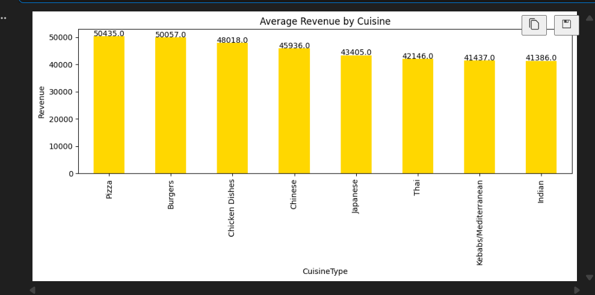
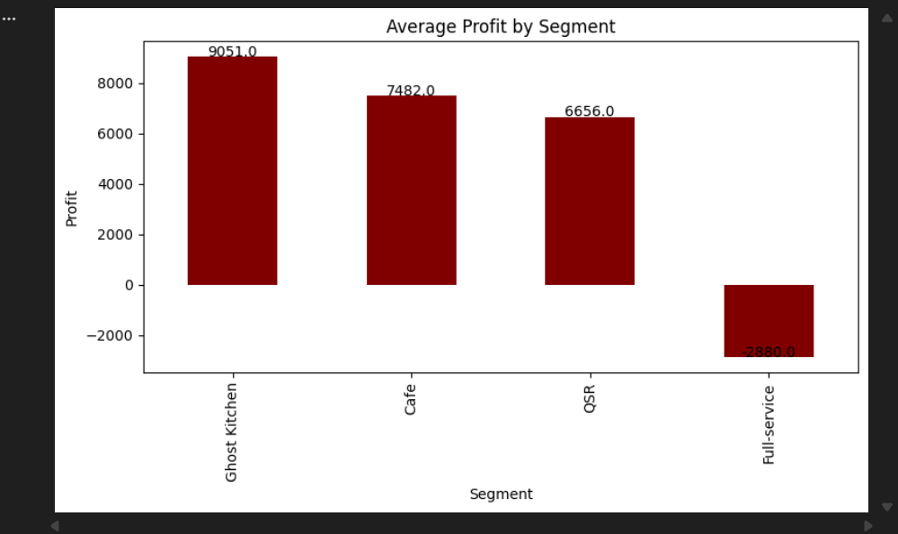
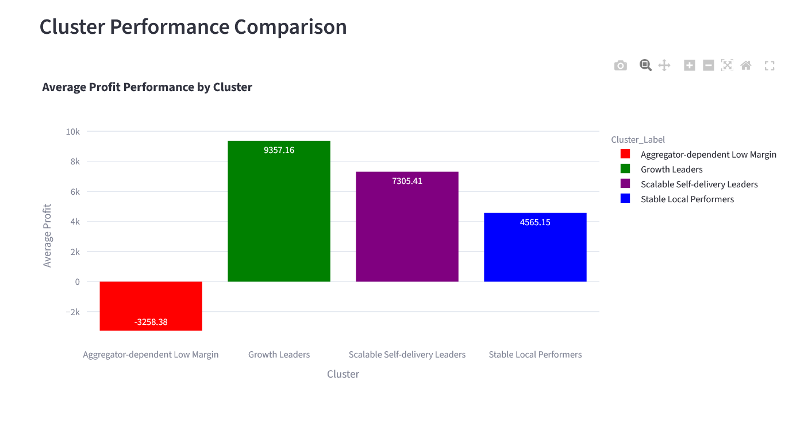
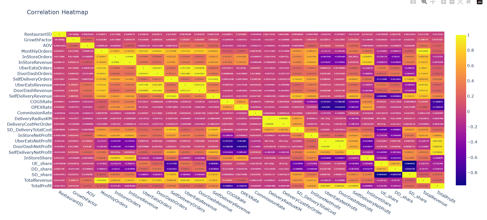
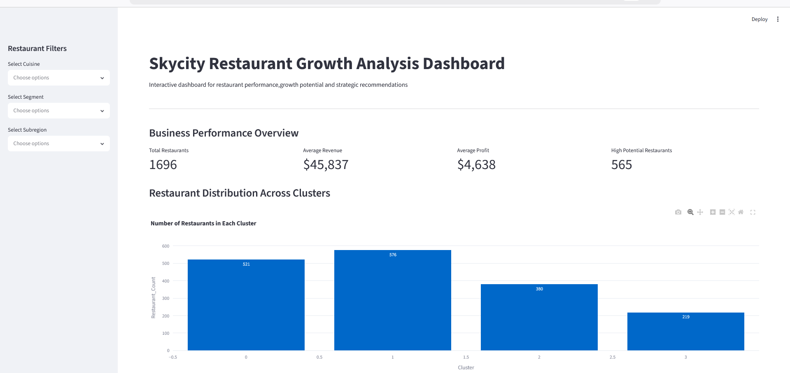
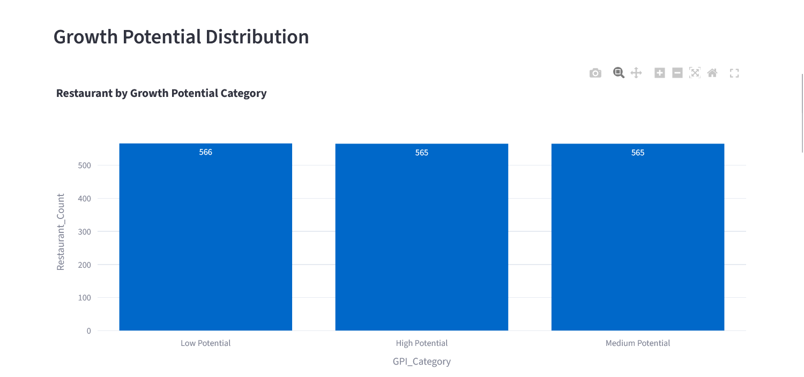
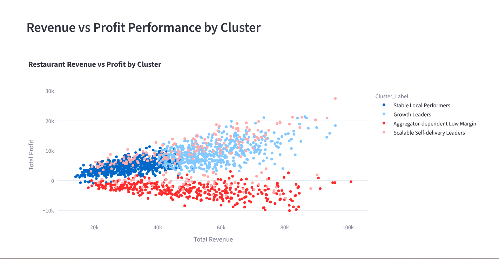
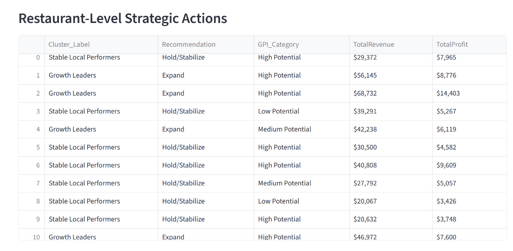

# Skycity Restaurant Growth Analysis Dashboard

## Project Overview
The skycity Restaurant Growth Analytics Dashboard is a data-driven analytics project developed to analyze restaurant performance,identify growth opportunities and generate strategic business recommendations. Using data analysis and machine learning techniques such as Exploratory Data Analysis(EDA), Feature Enginnering, Principal Componenet Analysis(PCA), and KMeans Clustering, restaurants are segemented into meaningful performance groups.

## Problem Statement
The restaurant industry generates large amounts of operational and financial data, but converting this data into meaningful business strategies is challenging. Restaurants have different performance patterns based on revenue generation, profitability,delivery channel dependency, operational efficiency , and growth potential. Applying the same strategy to all restaurants may lead to ineffective decisions. This project aims to analyze restaurant performance , identify different business segments using machine learning techniques, evaluate growth potential, and provide customized strategic recommendations such as expansion, stabilization, and optimization.

## Objectives
- Analyzing restaurant operational and financial performance
- Identifying important factors affecting revenue and profitability
- Understanding sales channel contribution and dependency
- Using machine learning techniques to classify restaurants into different segments
- Calculating Growth Potential Index  (GPI)
- Providing strategic recommendations for each restaurant segment
- Developing an interactive dashboard for business insights

## Dataset Description
The dataset contains *1696* restaurant records with attributes related to :
- CuisineType
- RestaurantID
- RestaurantName
- Segment
- Subregion
- GrowthFactor
- AOV
- MonthlyOrders
- In store sales performance
- Revenue generated from different channels
- Profit metrics
- Cost indicators
- Delivery channel performance
- Delivery dependency metrics
The dataset contains performance measures across multiple business channels:
- In- store operations
- Uber Eats
- DoorDash
- Self-delivery
Additional engineered features were created during analysis, including:
- Total Revenue
- Total Profit
- Profit Margin
- Revenue Quality
- Cost Burden
- Aggregator Dependence
- Expansion Headroom
These features were used for exploratory analysis, PCA, KMeans clustering, and growth potential index calculation to gain required business insights.

## Technologies Used
### Programming Language
- Python
### Libraries
- Pandas
- Numpy
- Matplotlib
- Seaborn
- Plotly
- Scikit-learn

## Dashboard Framework
The interactive dashboard was developed using **Streamlit**, a python-based framework for building data applications.
Key dashbaord components include:
- Performance overview metrics
- Revenue and profitability analysis
- Restaurant cluster visualization
- Growth potential Index analysis
- Channel performance insights
- Strategic recommendations based on restaurant segments.
This dasghboard allows business users to interact with data and identify restaurants suitable for expansion, stabilization, or optimization.

## Visualizations
### Monthly Order Overview

### AOV Distribution

### Cuisine Revenue Overview

### Segment Profit Overview

### Cluster Performance Overview

### Correlation Heatmap

### Dashbaord KPIs

### Growth Potential Distribution

### Revenue vs Profit

### Strategic Actions Overview

## Project Workflow
### Data Preprocessing
- Data cleaning
- Missing value handling
- Feature preparation
- Data transformation
### Exploratory Data Analysis:
- Monthly order distribution
- Average order value distribution
- Growth factor analysis
- Outlier detection
- Correlation analysis
- Channel performance analysis
### Fature Engineering
- Total Revenue
- Total Profit
- Profit Margin
- Revenue Quality
- Cost Burden
- Aggergator Dependence
- Expansion Headroom
### PCA and clustering
PCA was applied to reduce feature complexity and visualize performance patterns.
K-Means clustering was used to segment restaurantsinto four business groups:
- Growth Leaders
- Stable Local Performers
- Aggregator Dependent Low Margin
- Scaleble Self-delivery Leaders

## Growth Potential Index
A Growth Potential Index was developed using:
- Growth Factor
- Profit Margin
- Reveneue Quality
The index classifies restaurants into:
- High Potential
- Medium Potential
- Low Potential
This helps identify restaurantssuitable for expansion and those requiring improivement strategies.

## Results and Business Impact
The project successfully analyzed restaurant performance patterns and identified meaningful business segments using data analytics and machine learning techniques.
The dashboard provides actionable insights by identifying:
- Restaurants with high growth potential
- Stable Performers requiring monitoring
- Business requiring operational optimization
- Expansion opportunities based on performance indicators
By comibining clustering analysis and Growth Potential Index(GPI), the project supports data- driven decision-making for improving restaurant performance and strategic planning.

